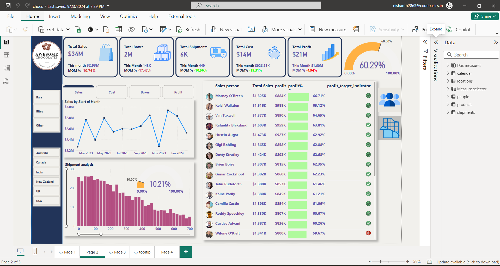

# Awesome Chocolate Sales Analytics 🍫📊

## Description
This project involves an in-depth analysis of chocolate sales, focusing on total sales, profit, costs, and shipments. Utilizing various analytical tools, this project aims to provide valuable insights into chocolate sales performance.

## Table of Contents 📚
- [Data Source](#data-source)
- [Key Findings](#key-findings)
- [Sales Performance Insights](#sales-performance-insights)
- [Technologies Used](#technologies-used)
- [Key Learnings](#key-learnings)
- [Formulas Learned](#formulas-learned)
- [Live Dashboard](#live-dashboard)
- [credits](#credits)

## Data Source 🌐
The data for this project was sourced from an Excel file, created using data from Chandoo, a well-known YouTube channel that offers extensive tutorials on Excel and data analysis.

## Key Findings 📈
- Total sales increased significantly in the last quarter.
- Profit margins improved due to cost-effective shipping methods.
- Key performance indicators (KPIs) highlight areas for potential growth.

## Sales Performance Insights
- **Total Sales**: $34 million USD
- **Total Costs**: $13 million USD
- **Current Month Sales**: $2.53 million USD (10% decrease from the previous month)
- **Country-Wise Sales**:
  - New Zealand: Highest sales share
  - Canada: $5.88 million USD (15% of total sales)
  - Australia: Ranked third
- **Top Products**:
  1. **Peanut Butter Cubes**: Nearly $2 million USD in sales, 87.14% profit margin
  2. **99% Dark & Pure Chocolate**: Second-highest sales
  3. **Manuka Honey Chocolate**: Third in sales
- **Shipment Details**:
  - Most frequent shipment: 80 boxes (263 total shipments)
- **Salesperson Performance**:
  - **Top Performer**: Marney O'Breen (66.71% profit margin)
  - **Next Performers**: Kelci Walkden and Van Tuxwell

## Technologies Used 🛠️
- **Power BI**: For data visualization and reporting,utilizing DAX calculations for advanced data analysis

## Key Learnings 📖
- KPI cards for summarizing important metrics.
- Reference labels for clarity in reports.
- Conditional formatting to highlight key data points.
- Tooltips for providing additional information in visualizations.
- Bookmarks to save and share specific report views.
- DAX measures for advanced calculations.
- Field parameters for dynamic data analysis.
- Alert icons for instant notification of critical metrics.

## Formulas Learned ✨
- `LASTDATE`: For retrieving the last date in a dataset.
- `CALCULATE`: For modifying the context of calculations.
- `RELATED`: For accessing related data in different tables.
- `EDATE`: For calculating a date that is a specified number of months from a start date.
- `IF`: For logical comparisons in calculations.
- `VAR & RETURN`: For defining variables in DAX measures.
- `PREVIOUSMONTH`: For analyzing trends from the previous month.

## Live Dashboard 🌐
You can view the live dashboard for this project [here](https://app.powerbi.com/view?r=eyJrIjoiODk0NTFkMDQtODNiMi00Mjc2LTgyMWEtYTVmMWQ0Mjc3NjcwIiwidCI6ImM2ZTU0OWIzLTVmNDUtNDAzMi1hYWU5LWQ0MjQ0ZGM1YjJjNCJ9).

## credits 📜
Credits go to my mentor, Chandoo, for teaching this awesome project and providing valuable insights into data analysis. You can check out his YouTube channel [Chandoo](https://www.youtube.com/@chandoo_)

